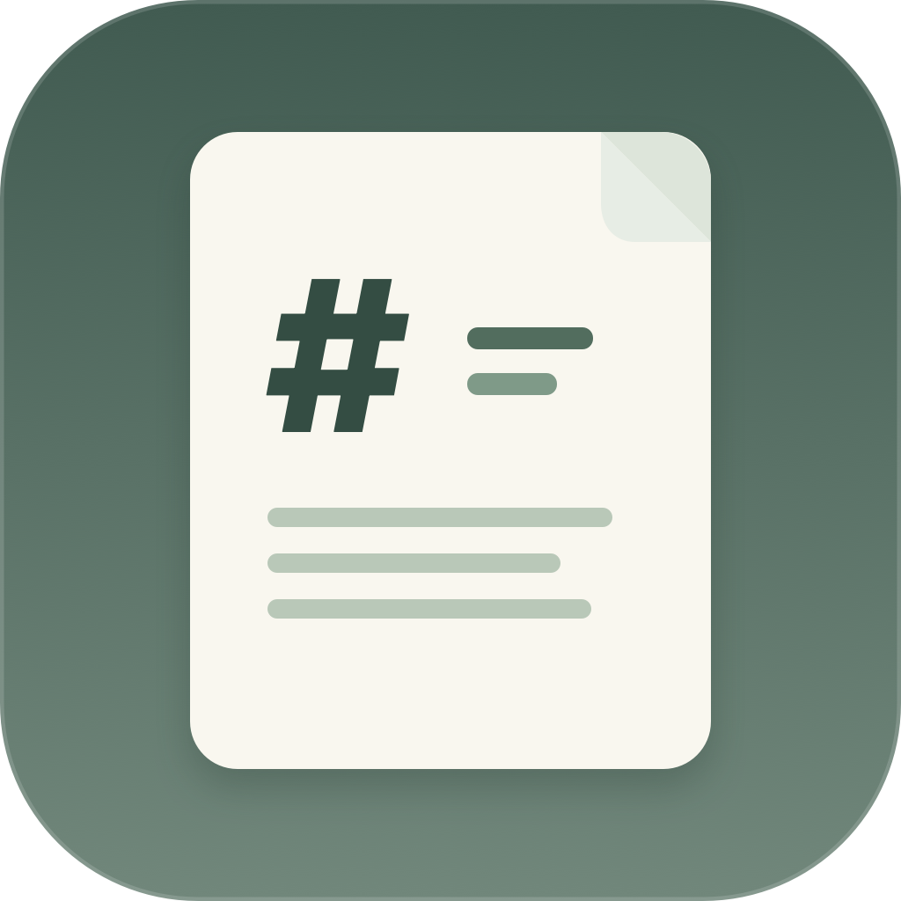

# 담백 MD

macOS용 로컬 Markdown 읽기 앱입니다. 한 창에서 한 문서를 읽으며, 파일 선택·드래그 앤 드롭·Finder의 **다음으로 열기**를 지원합니다. 앱은 원본 Markdown 파일을 수정하지 않습니다.

**바로 다운로드:** [최신 릴리스 페이지 열기](https://github.com/yuseungyeol-823/dambak-md/releases/latest) · [v0.1.2 macOS 앱 ZIP 직접 받기](https://github.com/yuseungyeol-823/dambak-md/releases/download/v0.1.2/DambakMD-v0.1.2-macOS.zip)

v0.1.2는 설치된 앱에서 문서를 열 때 종료되던 리소스 경로 문제를 수정합니다.



## 요구 환경과 빌드

- 최소 지원: macOS 13 Ventura
- 개발: Swift 6, Swift Package Manager, macOS SDK. Xcode를 설치한 환경이 가장 간단합니다.
- 이 저장소의 개발 기기에서는 Xcode 없이 Command Line Tools와 macOS 15.4 SDK를 사용했습니다. 기본 26.5 SDK와 Swift 컴파일러 버전이 일치하지 않아 빌드 스크립트가 15.4 SDK를 선택합니다.

```sh
./Scripts/build-app.sh
open '.build/담백 MD.app'
```

Finder에서 `.md` 또는 `.markdown` 파일을 우클릭해 **다음으로 열기 → 담백 MD**를 선택할 수 있습니다. 기본 연결 앱은 자동으로 바꾸지 않습니다. 개발자가 로컬 샘플을 확인하려면 `open -a "$PWD/.build/담백 MD.app" "$PWD/Samples/담백 샘플.md"`를 사용하세요.

핵심 로직 검증은 `swift run DambakSelfTest`로 실행합니다. 이 기기의 Command Line Tools에는 XCTest와 Swift Testing 모듈이 없어 별도 검증 실행 파일을 사용했습니다.

## 다운로드와 설치

### 브라우저와 Finder로 설치

1. [담백 MD v0.1.2 릴리스 페이지](https://github.com/yuseungyeol-823/dambak-md/releases/tag/v0.1.2)를 엽니다.
2. **Assets**에서 **DambakMD-v0.1.2-macOS.zip**을 클릭해 다운로드합니다. GitHub가 자동으로 제공하는 **Source code (zip)**은 앱 실행 파일이 아니므로 선택하지 마세요.
3. Finder의 다운로드 폴더에서 ZIP을 더블클릭해 압축을 풉니다.
4. 나온 **담백 MD.app**을 Finder의 **응용 프로그램** 폴더로 드래그한 뒤 실행합니다.

이 빌드는 Apple Developer 공증을 받지 않았습니다. macOS가 첫 실행을 막으면 **시스템 설정 → 개인정보 보호 및 보안 → 그래도 열기**에서 직접 허용할 수 있습니다. 자세한 절차는 [Apple의 앱 열기 안내](https://support.apple.com/ko-kr/102445)를 참고하세요.

### 터미널로 설치

터미널에서는 다음 두 명령으로 설치할 수 있습니다. 스크립트는 릴리스 ZIP과 SHA-256 파일을 받아 해시를 확인한 후 `~/Applications`에 앱을 복사합니다.

```sh
curl -fsSL https://raw.githubusercontent.com/yuseungyeol-823/dambak-md/main/Scripts/install.sh -o /tmp/dambak-install.sh
sh /tmp/dambak-install.sh 0.1.2
```

저장소를 이미 내려받았다면 `sh Scripts/install.sh 0.1.2`을 실행해도 됩니다.

릴리스 ZIP과 체크섬은 GitHub Actions가 Intel·Apple Silicon 겸용 앱을 빌드해 게시합니다.

## 구현

- GitHub Flavored Markdown: 제목, 강조, 취소선, 목록, 체크박스, 표, 코드, 링크, 이미지
- H1~H6 목차, 중복 제목 앵커, 클릭 즉시 선택 표시와 현재 읽는 제목 강조
- 본문 검색, 결과 수와 앞뒤 이동, 코드 복사
- 상대 Markdown 링크와 내부 앵커, 외부 웹 링크는 기본 브라우저에서 열기
- 최근 문서 20개, 읽던 위치와 설정 저장, 뒤로·앞으로 이동
- 파일과 상위 디렉터리 변경 감시로 일반 저장 및 atomic save 반영
- 로컬에서만 로드하는 구문 강조 자산
- 전체 화면에서는 최근 문서 목록을 자동으로 접고 본문 너비를 화면에 맞게 넓힘. 사이드바 버튼으로 다시 펼칠 수 있음

## 구조와 의존성

- `Sources/DambakCore`: Apple `swift-markdown` 0.9.x로 GFM 구문을 파싱하고 허용한 요소만 HTML로 변환합니다. cmark-gfm 기반의 관리되는 파서를 사용하기 위해 선택했습니다.
- `Sources/DambakMD`: SwiftUI 화면, 문서 상태·감시, WKWebView 연결. `Resources/reader.js`가 검색·목차 위치·복사를 담당합니다.
- `Assets/DambakMD.icns`: macOS 앱 아이콘. `Scripts/generate-icon.swift`에서 크기별 PNG와 `.icns`를 다시 생성할 수 있습니다.
- `highlight.js` 11.12.0을 앱에 포함해 오프라인 구문 강조를 제공합니다. 라이선스는 `Sources/DambakMD/Resources/HIGHLIGHT-LICENSE.txt`에 있습니다.
- `Samples`: 한글·공백 경로의 이미지, 중복 제목, 긴 문서, 안전성 입력을 포함한 검증 문서.

## 안전성과 제한

원본 문서의 raw HTML은 렌더링하지 않고, `javascript:` 같은 URL을 거릅니다. WKWebView의 페이지 이동은 제한하며 이미지는 현재 문서 폴더 내부의 PNG/JPEG/GIF/WebP만 최대 20MB까지 읽습니다. 코드 자산은 앱 안에 포함되고, 문서 읽기에 네트워크가 필요하지 않습니다. 외부 링크를 선택할 때만 기본 브라우저를 엽니다.

상대 파일 링크·이미지의 공백은 Markdown URL 문법에 따라 `%20`으로 적어야 합니다. 이미지가 상위 폴더에 있는 `../` 경로와 SVG 이미지는 현재 버전에서 차단합니다. 읽기 위치는 제목과 상대 위치를 기준으로 최대한 복원하므로 제목을 크게 바꾼 경우 정확하지 않을 수 있습니다. 문서 파일은 UTF-8, 최대 12MB까지 지원합니다. 이 개발 빌드는 서명·공증되지 않았으며 App Sandbox를 켜지 않았습니다. 권한 지속용 보안 범위 북마크는 저장하지만 샌드박스 배포 구성은 별도로 검증해야 합니다.

## 단축키

- `⌘O` 파일 열기, `⌘F` 검색, `⌘[` / `⌘]` 뒤로·앞으로
- `⌘+` / `⌘-` / `⌘0` 글자 크기 조절·초기화
